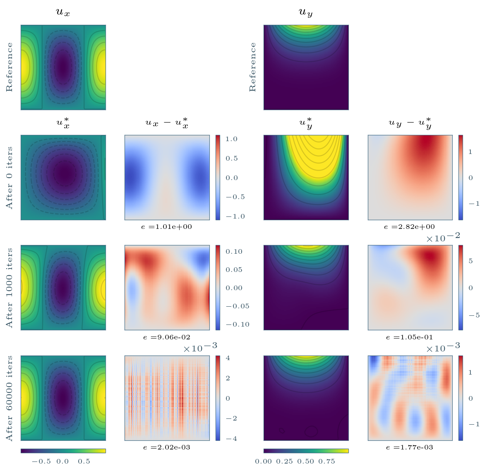
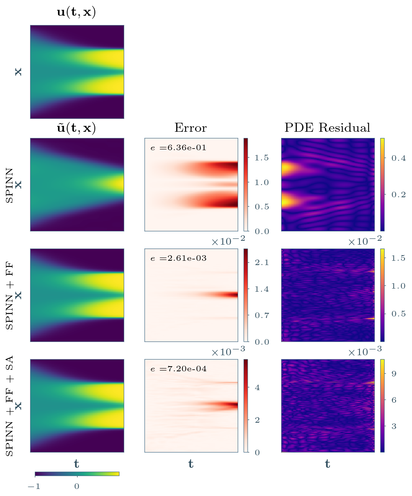
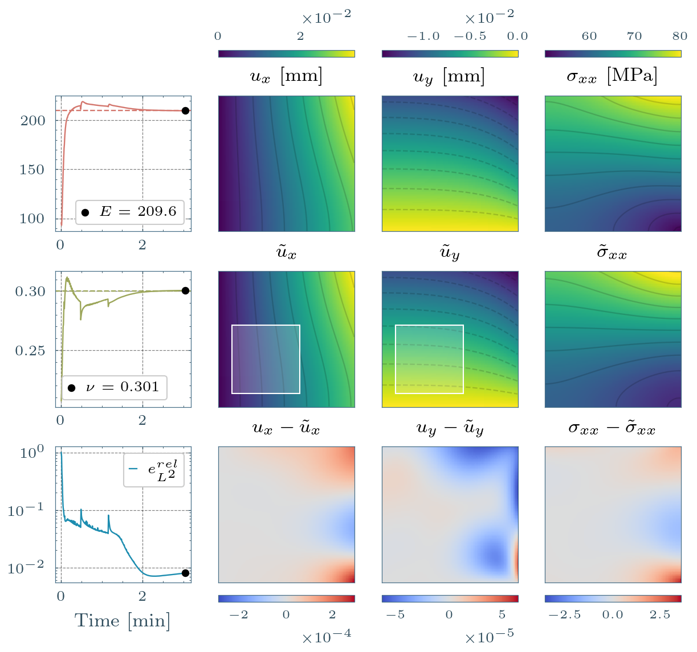
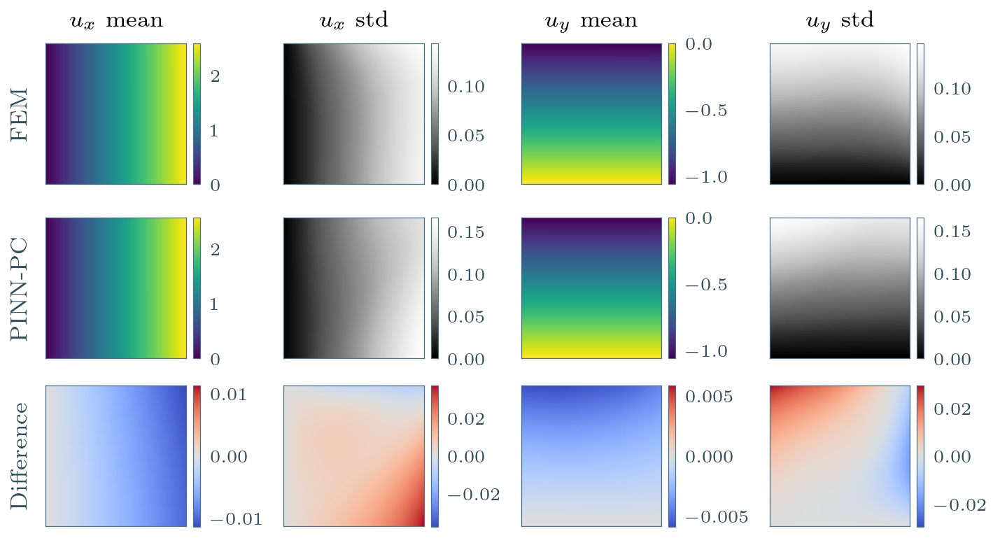

# Physics-Informed Neural Networks for Material Modeling
## Robust and Efficient Frameworks for Inverse Material Characterization and Uncertainty Propagation

Companion code for the PhD thesis. This repository maps thesis chapters to executable notebooks, reusable library modules, and saved results.

## Thesis Chapter Navigation

### Chapter II - PINNs
- Scope: PINN foundations, JAX/DeepXDE implementation, 1D Poisson, and plate mechanics examples.
- Notebooks: 
    - `chapters/II_PINNs/01_pinn_intro.ipynb`
    - `chapters/II_PINNs/02_jax_library.ipynb`
    - `chapters/II_PINNs/03_poisson_equation.ipynb`
    - `chapters/II_PINNs/04_plate_example.ipynb`

### Chapter III - Improving PINNs
- Scope: SPINN formulation, computational scaling, Fourier features, self-adaptive weighting, and geometry mapping.
- Notebooks: 
    - `chapters/III_ImprovingPINNs/01_spinn_computation.ipynb`
    - `chapters/III_ImprovingPINNs/02_spinn_plate_example.ipynb` 
    - `chapters/III_ImprovingPINNs/03_spinn_geo_mapping.ipynb` 
    - `chapters/III_ImprovingPINNs/04_improving_spinn_ap.ipynb` 
    - `chapters/III_ImprovingPINNs/05_improving_spinn_ac.ipynb`

### Chapter IV - Material Characterization
- Scope: inverse identification in continuum mechanics (side-loaded plate, deep-notched specimen, clamped plate), including noisy and partial-field settings.
- Notebooks:
    - `chapters/IV_MaterialCharacterization/01_side_loaded_plate/`
    - `chapters/IV_MaterialCharacterization/02_deep_notched/`
    - `chapters/IV_MaterialCharacterization/03_clamped_plate/`

### Chapter V - Uncertainty Propagation
- Scope: stochastic PINN workflows (PINN-PC, SPINN-NC) on Poisson and composite-plate problems.
- Notebooks:
    - `chapters/V_UncertaintyPropagation/01_poisson_equation/01_poisson_equation.ipynb`
    - `chapters/V_UncertaintyPropagation/02_composite_plate/01_FEM.ipynb`
    - `chapters/V_UncertaintyPropagation/02_composite_plate/02_PINN_PC.ipynb`

## Python Library Structure

Core implementation is in `src/phd`:

- `src/phd/config`: Hydra/OmegaConf config loading and controlled overrides.
- `src/phd/models`: problem entrypoints (`train(cfg=None, overrides=None)`).
- `src/phd/physics`: reusable PDE and constitutive-mechanics operators.
- `src/phd/io`: run persistence, callbacks, reload/continue utilities.
- `src/phd/plot`: reusable plotting and chapter artifact export helpers.
- `src/phd/geo`: geometry mappings for non-rectangular domains.

## Minimal Workflow

1. Load a problem config from `configs/*.yaml`.
2. Train with the corresponding model entrypoint in `src/phd/models`.
3. Save run artifacts in `results/{problem}/{run_name}`.
4. Use chapter notebooks to regenerate figures/tables for the thesis.
